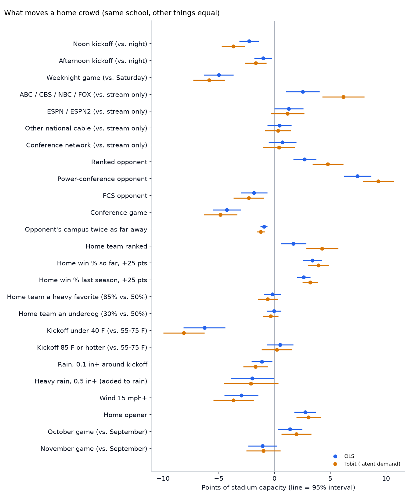
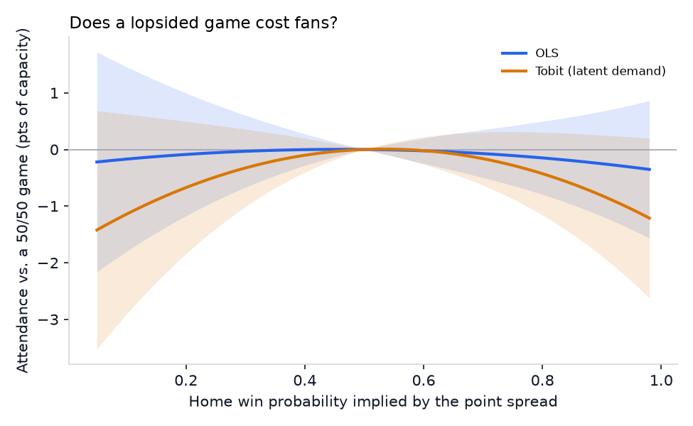

# College Football Ticket Demand

What drives attendance at college football home games? What is each factor
worth in seats and dollars? And which upcoming games are at risk of
underselling?

This project models every FBS home game from ten seasons (2015-2025,
skipping 2020) with data from CollegeFootballData.com and Open-Meteo
weather. It answers the first two questions with interpretable regressions.
It answers the third with a gradient-boosted model, tested on a season it
never saw, and with weekly predictions that are committed to git before
kickoff.

## Read this first: what the numbers mean

- **This models ticket demand, not turnout.** Many schools announce
  *tickets distributed* (season tickets, comps, student allotments), not
  people in seats. An empty seat that was paid for still counts. Every
  "attendance" figure here is the school's announced number.
- **Sellouts hide demand.** A sold-out game only tells you demand was *at
  least* capacity. 24% of games in the sample sold out (98% of capacity or
  more). A censored (Tobit) regression and a two-part model ("will it sell
  out?" plus "how full if not?") handle this. For schools that sell out
  often, the demand *above* capacity is the interesting part.
- **Capacity is today's listed capacity.** CFBD stores one capacity per
  stadium. Expansions and renovations make older fill rates approximate.
  Team fixed effects absorb a school's average, and a team-by-season
  version of the model absorbs any single season's quirks.
- **Dollars are an assumption, not data.** Schools don't publish revenue
  per seat. Dollar figures assume **$75 per ticket at power-conference
  schools and $25 elsewhere**, a blend of season, single-game and student
  pricing. Change `ASSUMED_TICKET_PRICE` in `ticketing/config.py` to
  re-price everything.
- **Effects are "other things equal," not experiments.** Networks pick
  night and ABC/FOX slots partly for games they expect to draw. The models
  control for opponent quality, rankings, records, the spread and each
  school's own baseline, but some of that selection likely remains in the
  TV and kickoff effects.

## Results

### What moves a home crowd



Each school is compared with itself (team and season fixed effects,
standard errors clustered by school). One point of capacity is about 515
seats at the average FBS stadium (51,500 seats). The dollar column uses the
assumed prices above.

| Factor | Attendance, pts of capacity (95% CI) | Seats per game | $ per game (assumed) | Demand incl. above capacity (Tobit) |
|---|---:|---:|---:|---:|
| Noon kickoff (vs. night) | -2.3 (-3.1 to -1.4) | -1,170 | -$70k | -3.7 |
| Afternoon kickoff (vs. night) | -1.0 (-1.8 to -0.2) | -520 | -$31k | -1.7 |
| Weeknight game (vs. Saturday) | -5.0 (-6.3 to -3.7) | -2,570 | -$153k | -5.9 |
| ABC / CBS / NBC / FOX (vs. stream only) | +2.5 (+1.0 to +4.0) | +1,310 | +$78k | +6.2 |
| ESPN / ESPN2 (vs. stream only) | +1.3 (0.0 to +2.6) | +660 | +$39k | +1.2 |
| Power-conference opponent | +7.4 (+6.2 to +8.7) | +3,830 | +$228k | +9.3 |
| Ranked opponent | +2.7 (+1.7 to +3.7) | +1,390 | +$83k | +4.8 |
| FCS opponent | -1.8 (-3.0 to -0.6) | -940 | -$56k | -2.3 |
| Conference game | -4.3 (-5.5 to -3.0) | -2,210 | -$131k | -4.8 |
| Home team's win % so far, +25 pts | +3.4 (+2.5 to +4.2) | +1,740 | +$104k | +3.9 |
| Home team ranked | +1.7 (+0.6 to +2.8) | +880 | +$52k | +4.3 |
| Kickoff under 40 F (vs. 55-75 F) | -6.3 (-8.2 to -4.4) | -3,230 | -$192k | -8.1 |
| Rain, 0.1 in+ around kickoff | -1.1 (-2.1 to -0.2) | -580 | -$34k | -1.7 |
| Heavy rain, 0.5 in+ (on top of rain) | -2.0 (-3.9 to -0.1) | -1,030 | -$61k | -2.1 |
| Wind 15 mph+ | -3.0 (-4.5 to -1.5) | -1,530 | -$91k | -3.7 |
| Home opener | +2.7 (+1.8 to +3.7) | +1,410 | +$84k | +3.1 |

What stands out:

- **Opponent and day matter most.** A power-conference visitor is worth
  about 3,800 seats. Moving a game to a weeknight costs about 2,600.
- **Cold beats rain.** A sub-40 F kickoff costs more than heavy rain.
  Wind also hurts on its own.
- **Kickoff time is real but modest.** Noon costs about 2.3 points of
  capacity against a night game. The Tobit roughly doubles several
  effects (broadcast TV, ranked teams). Those factors mostly raise demand
  at games that were selling out anyway, where the reported crowd can't
  show it.
- **Conference games draw less** than non-conference games against the
  same caliber of opponent. This holds with September, October and
  November controlled, so it isn't an early-season effect.
- **Robustness:** the effects barely move under team-by-season fixed
  effects, with Elo ratings added, or in the two-part model. See
  `results/explain/effects_all_models.csv`.

### Do lopsided games cost fans? (uncertainty of outcome)



The uncertainty-of-outcome hypothesis says fans want a contest, so demand
should peak near a toss-up and fall as the spread widens. The rival
"home fans want a win" view says demand rises with the home team's
chances. The test uses the home win probability implied by the betting
spread (and its square) in the fixed-effects models above.

- **Reported attendance: no effect.** The curvature is nowhere near
  significant (p = 0.64). Every spread bucket, from 28-point favorite to
  7-point underdog, is within 0.6 points of a close game.
- **At the margin, a hint of one.** In the Tobit, demand bends down
  slightly on both sides of about 53% (p = 0.055). In the sellout model,
  being a heavy favorite (85% vs. 50%) cuts the chance of a sellout by
  about 3 points (p = 0.006).

**Verdict:** lopsided spreads don't measurably empty seats. Any effect is
small and shows up only in whether a near-sellout gets over the line.
That fits the mixed evidence in the sports economics literature.

### Demand hidden behind sellouts

For each sold-out game the Tobit estimates how many people likely wanted
in: E[demand | demand ≥ capacity]. Demand well above capacity, game after
game, suggests tickets priced below what the market would bear.

| School | Sellouts / home games | Avg. demand when sold out | Unmet seats per sellout |
|---|---:|---:|---:|
| Alabama | 61 / 70 | 120% of capacity | ~19,900 |
| Ohio State | 61 / 70 | 118% | ~18,600 |
| Clemson | 54 / 68 | 118% | ~14,400 |
| Kansas State | 54 / 66 | 117% | ~8,700 |
| Penn State | 52 / 70 | 115% | ~16,400 |

**Clemson.** Clemson sold out 54 of 68 home games. Its sellouts averaged
an estimated 118% of capacity, roughly 14,000 people per game who wanted
tickets and couldn't get them. The largest gaps were the biggest games:

- LSU in the 2025 opener: about 131% of capacity, ~25,000 unmet seats,
  about $1.9M at the assumed $75
- South Carolina in 2024: about 125%
- Notre Dame and Florida State in 2023: about 118-119%

Those are the games where pricing looked furthest below demand. 2025 was
different: Clemson sold out only 3 of 7 games. Troy, SMU, Duke and Furman
all came in at 93-97% of capacity.

Caveats: demand above capacity is extrapolated from the shape of the
model (normal errors), so treat the levels as estimates. Georgia, Michigan
and Nebraska sold out every game in the sample. With no unsold game to
anchor them, their excess demand can't be estimated from attendance, so
they're flagged rather than ranked. Full tables are in
`results/explain/hidden_demand_*.csv`.

### Predicting a season the model never saw

The gradient-boosted model was tuned by leave-one-season-out validation on
2015-2024, then scored once on 2025:

| Forecast | Error, pts of capacity (MAE) | Error, seats | R² |
|---|---:|---:|---:|
| School's average last season | 8.1 | 3,220 | 0.71 |
| School's average so far this season | 7.5 | 2,880 | 0.72 |
| Fixed-effects regression | 8.2 | 3,310 | 0.73 |
| **Gradient boosting** | **6.2** | **2,490** | **0.82** |
| Gradient boosting without "fill so far" (what the live run uses early in a season) | 6.7 | 2,720 | 0.80 |

- **Sellouts:** the sellout-chance model ranks games well (AUC 0.95) and
  beats the school's past sellout rate (Brier 0.084 vs. 0.116).
- **Intervals:** the 10-90% band contained 78% of 2025 games, close to
  the 80% target.
- **At-risk flag** (forecast 5+ points below the school's normal crowd):
  77% of flagged 2025 games really did come in 5+ points low, and the
  flag caught 47% of all such games.
- **What it leans on:** mostly each school's own demand history (last
  season's fill, this season's so far), then opponent, record and
  distance.

### The live test (2026)

Each week, once kickoff times are announced, `05_predict_week.py`
predicts every home game with a known kickoff, using the weather forecast
and the current betting line. The files are committed to git before the
first game. The commit timestamp is the proof the prediction came first.
Push the repo to GitHub for a third-party timestamp. After the weekend,
`06_score_week.py` grades them against the reported attendance.

- First committed week: [`predictions/2026/week_06.md`](predictions/2026/week_06.md)
  (53 games, Oct 6-10).
- CFBD posts attendance weeks after the games. Until it does, the live
  model leaves out "fill so far this season" (it can't be known), and
  scoring waits for the numbers to appear.

## How to run

```bash
python3.12 -m venv .venv
.venv/bin/pip install -r requirements.txt
cp .env.example .env        # then paste your free key from collegefootballdata.com/key

.venv/bin/python scripts/01_pull_data.py             # every API pull, saved to data/raw/ (about an hour the first time)
.venv/bin/python scripts/02_build_dataset.py         # one row per home game
.venv/bin/python scripts/03_explain_attendance.py    # effects, uncertainty of outcome, hidden demand
.venv/bin/python scripts/04_test_predictive_model.py # validation and the 2025 holdout
```

Each week during the season:

```bash
.venv/bin/python scripts/05_predict_week.py --commit       # before kickoff (re-run later for TBD games)
.venv/bin/python scripts/06_score_week.py --week 6 --commit  # once attendance is posted
```

Re-running steps 1-4 costs no API calls; every pull is cached in
`data/raw/`. The free CFBD tier allows 1,000 calls a month, and the full
history uses about 50.

## Project layout

```
ticketing/              shared code, imported by every script
  config.py             every setting and assumption (seasons, sellout cutoff, ticket prices)
  cfbd.py               cached CollegeFootballData.com client
  weather.py            cached Open-Meteo client (archive and forecast)
  features.py           raw pulls -> one row per home game
  models.py             fixed-effects OLS, Tobit, drivers, gradient boosting
  charts.py             shared chart style
scripts/                run in order, 01 -> 06
data/processed/         the modeling table (data/raw/ is a local cache, not committed)
results/explain/        effects, uncertainty of outcome, hidden demand
results/predict/        validation, holdout scores, tuned settings
predictions/2026/       weekly committed predictions and scorecards
memo/                   one-page memo for a ticketing team
```

## Data

- [CollegeFootballData.com](https://collegefootballdata.com): games,
  attendance, venues, TV, betting lines, polls. A free API key is
  required.
- [Open-Meteo](https://open-meteo.com): hourly historical weather and
  forecasts, licensed CC BY 4.0.
- Sample: regular-season games on an FBS team's home field. Neutral-site
  games, bowls, conference championships and all of 2020 are excluded, as
  are games with missing or impossible attendance (8,148 games remain).
